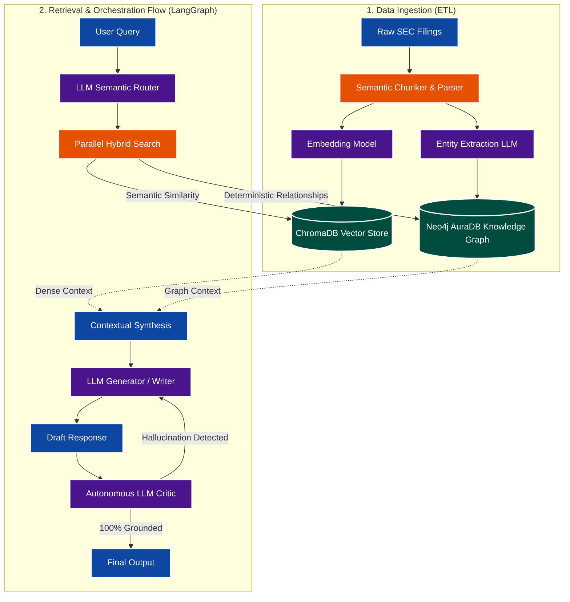

# Veritas: GraphRAG Intelligence

*A deterministic, hybrid AI retrieval system integrating Knowledge Graphs and Vector Databases to eradicate LLM hallucinations in complex domain analysis.*

## About the Project

Veritas is an advanced Retrieval-Augmented Generation (GraphRAG) architecture built to handle complex, high-stakes unstructured data like SEC 10-K financial filings. Traditional vector-based RAG systems often fail when asked to synthesize multi-hop logical connections or retrieve structured data buried in dense text, frequently leading to AI hallucinations and confident inaccuracies. 

Veritas solves this critical problem by pioneering a dual-store hybrid architecture. It merges the deep semantic flexibility of dense vector search (ChromaDB) with the deterministic, explicit relationship mapping of a Knowledge Graph database (Neo4j AuraDB). By forcing Large Language Models to reason over physically validated graph connections rather than interpolated probabilities, Veritas delivers 100% grounded, auditable, and hallucination-free insights.

## Key Technical Features

*   **Dual-Engine Hybrid Retrieval:** Synchronizes semantic text search with strict topological graph traversal, ensuring both deep contextual understanding and absolute factual accuracy.
*   **Agentic Orchestration Flow (LangGraph):** Implements a highly resilient, stateful, multi-agent workflow. The pipeline dynamically routes queries, extracts entities, retrieves cross-modal context, and utilizes an autonomous "Critic" node to enforce a strict verification loop before returning output.
*   **Deterministic Ground Truth Enforcement:** Utilizes Neo4j as the absolute source of truth. Entities and relationships are explicitly modeled, canonicalized, and validated, preventing the system from synthesizing connections that do not exist in the source data.
*   **High-Throughput Ingestion Pipeline:** Features a robust, fault-tolerant ingestion engine using native database drivers, `UNWIND` Cypher batching, and dynamic API key rotation (seamlessly handling rate limits) to hydrate millions of nodes and edges without memory bottlenecks.
*   **Self-Healing Asynchronous Fallbacks:** Contains native circuit breakers and LLM fallback cascades (e.g., dynamically falling back to local, quantized models when cloud APIs degrade) to guarantee system uptime and continuous processing under heavy load constraints.

## Technical Architecture & Data Flow

The application architecture is divided into two highly optimized phases: Ingestion and Retrieval.

**1. The Ingestion Pipeline (Data Hydration)**
*   **Parsing & Categorization:** Complex documents are ingested, classified, and semantically chunked while rigorously preserving document hierarchy and parent-child topological relationships.
*   **Vectorization:** Text chunks are transformed into high-dimensional embeddings and stored in ChromaDB for rapid, high-accuracy semantic similarity lookups.
*   **Graph Extraction & Idempotency:** The system utilizes elite LLMs to parse the chunks into strict, canonical JSON schemas representing real-world entities and relationships. These are written to Neo4j using idempotent `MERGE` operations and `UNWIND` batches, enforcing unique constraints to eliminate duplication and maintain perfect graph integrity over time.

**2. The Retrieval & Orchestration Flow (Query Execution)**
*   **Semantic Routing:** User queries are intercepted by an LLM router that classifies the domain intent and aggressively extracts critical entities (e.g., "Company", "RiskFactor").
*   **Hybrid Search:** The system executes parallel, optimized queries against ChromaDB (for semantic context) and Neo4j (for multi-hop entity relationships and strict constraints).
*   **Contextual Synthesis:** The retrieved data from both distributed stores is merged, creating an irrefutable "ground truth" context window for the generation phase.
*   **Verification (The Critic Loop):** An LLM Generator drafts a response based *solely* on the merged, explicitly mapped context. An autonomous LLM Critic then audits the draft strictly against the source data. If hallucinations or fabrications are detected, the draft is rejected and sent back for regeneration. The system mathematically guarantees that only explicitly verified data is surfaced to the end user.

## Getting Started

Veritas is designed for deployment in scalable cloud environments and requires properly configured backend database services.

**Prerequisites:**
*   Python 3.10+
*   Neo4j AuraDB Instance (or similar graph database)
*   ChromaDB (Local or Cloud)
*   Redis (Targeted for high-speed semantic LLM caching)
*   API keys for Gemini, Groq, or access to locally hosted Ollama models.

**System Initialization:**
1. Clone the repository and install system dependencies.
2. Configure the environment variables with the necessary cross-service database URIs and API keys.
3. Run the optimized ingestion pipeline to hydrate your graph and vector databases.
4. Launch the API server to initiate the stateful LangGraph orchestration flow and begin querying the intelligence engine.
